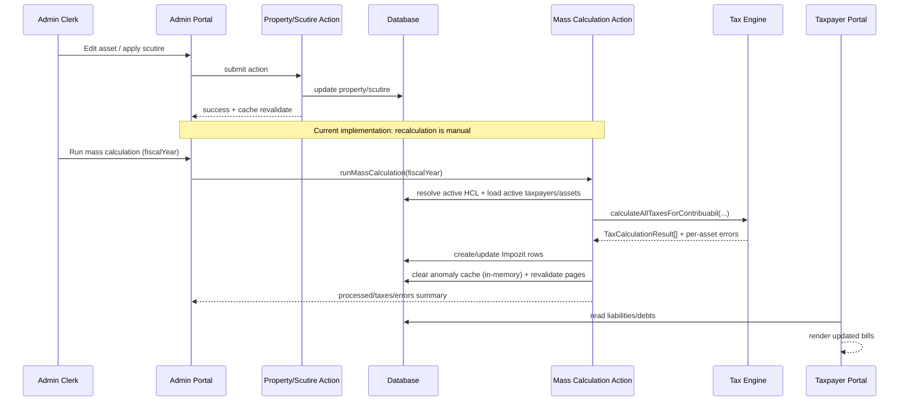
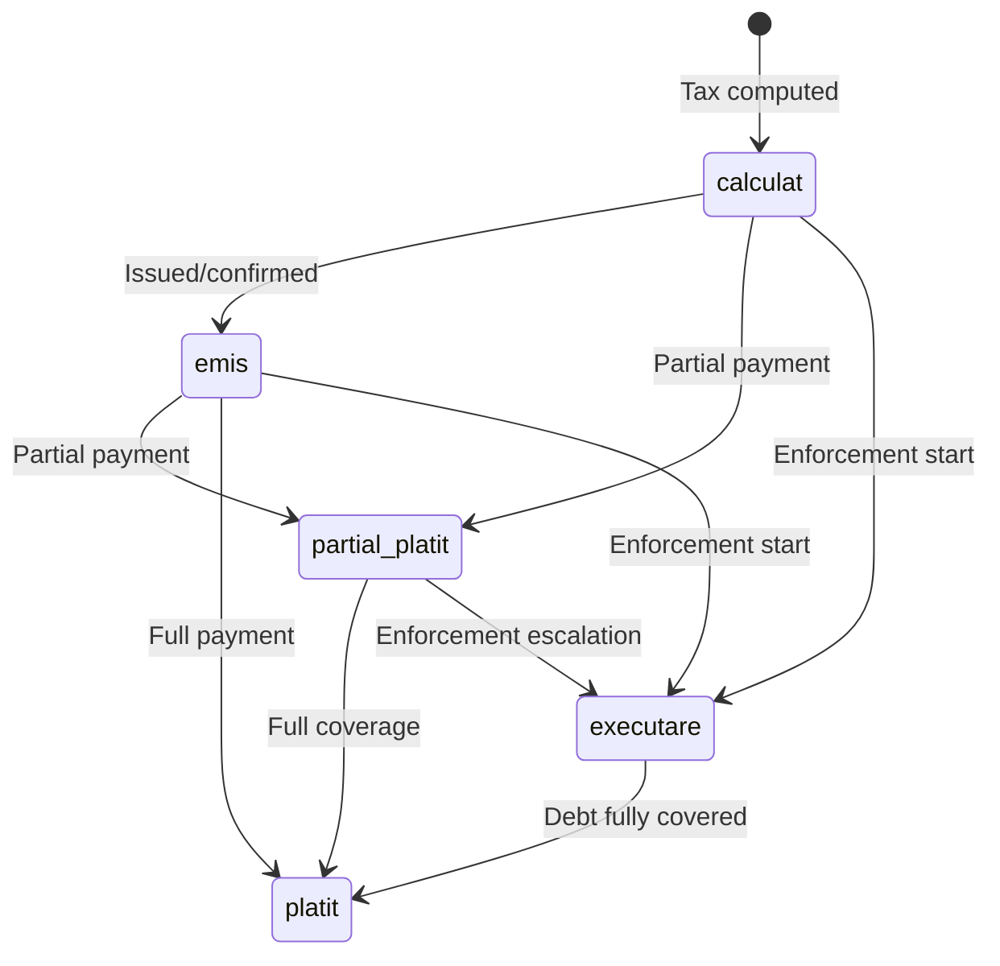
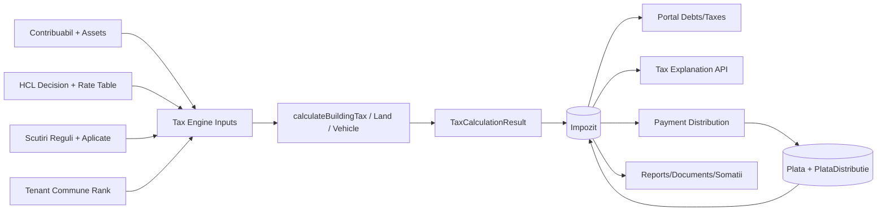

# TAX ENGINE WORKFLOW

## 1) Sequence: Asset Edit -> Recalculation -> Portal View

```mermaid
sequenceDiagram
  participant Clerk as Admin Clerk
  participant AdminUI as Admin Portal
  participant AssetAction as Property/Scutire Action
  participant DB as Database
  participant CalcAction as Mass Calculation Action
  participant Engine as Tax Engine
  participant Portal as Taxpayer Portal

  Clerk->>AdminUI: Edit asset / apply scutire
  AdminUI->>AssetAction: submit action
  AssetAction->>DB: update property/scutire
  AssetAction-->>AdminUI: success + cache revalidate

  Note over AdminUI,CalcAction: Current implementation: recalculation is manual
  Clerk->>AdminUI: Run mass calculation (fiscalYear)
  AdminUI->>CalcAction: runMassCalculation(fiscalYear)
  CalcAction->>DB: resolve active HCL + load active taxpayers/assets
  CalcAction->>Engine: calculateAllTaxesForContribuabil(...)
  Engine-->>CalcAction: TaxCalculationResult[] + per-asset errors
  CalcAction->>DB: create/update Impozit rows
  CalcAction->>DB: clear anomaly cache (in-memory) + revalidate pages
  CalcAction-->>AdminUI: processed/taxes/errors summary

  Portal->>DB: read liabilities/debts
  Portal-->>Portal: render updated bills
```

## 2) Liability Lifecycle State Machine

```mermaid
stateDiagram-v2
  [*] --> calculat: Tax computed
  calculat --> emis: Issued/confirmed
  calculat --> partial_platit: Partial payment
  emis --> partial_platit: Partial payment
  partial_platit --> platit: Full coverage
  emis --> platit: Full payment
  calculat --> executare: Enforcement start
  emis --> executare: Enforcement start
  partial_platit --> executare: Enforcement escalation
  executare --> platit: Debt fully covered
```

## 3) Dataflow: Inputs -> Compute -> Persistence -> Audit

```mermaid
flowchart LR
  A[Contribuabil + Assets] --> B[Tax Engine Inputs]
  C[HCL Decision + Rate Table] --> B
  D[Scutiri Reguli + Aplicate] --> B
  E[Tenant Commune Rank] --> B

  B --> F[calculateBuildingTax / Land / Vehicle]
  F --> G[TaxCalculationResult]
  G --> H[(Impozit)]

  H --> I[Portal Debts/Taxes]
  H --> J[Tax Explanation API]
  H --> K[Payment Distribution]
  K --> L[(Plata + PlataDistributie)]
  L --> H

  H --> M[Reports/Documents/Somatii]
```
