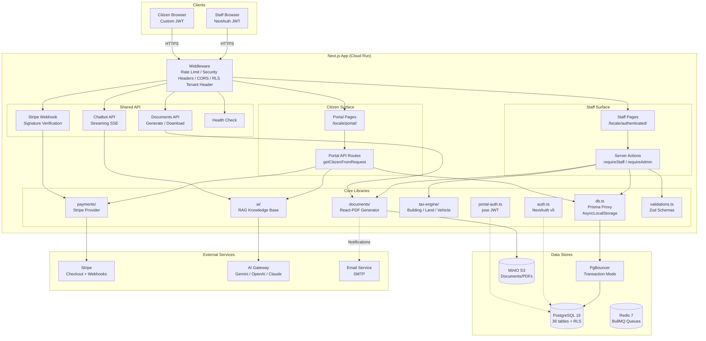
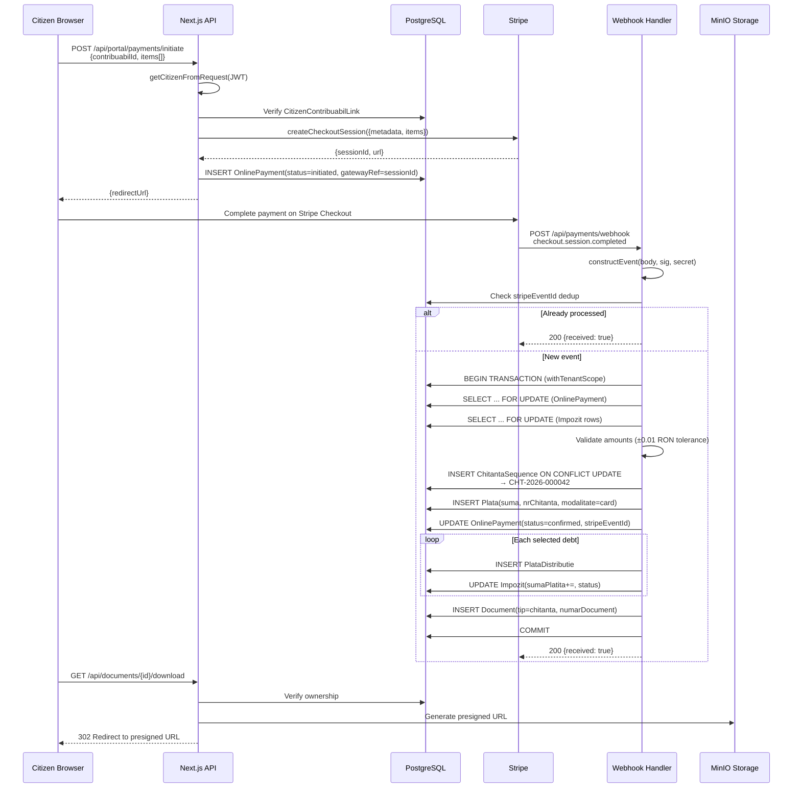
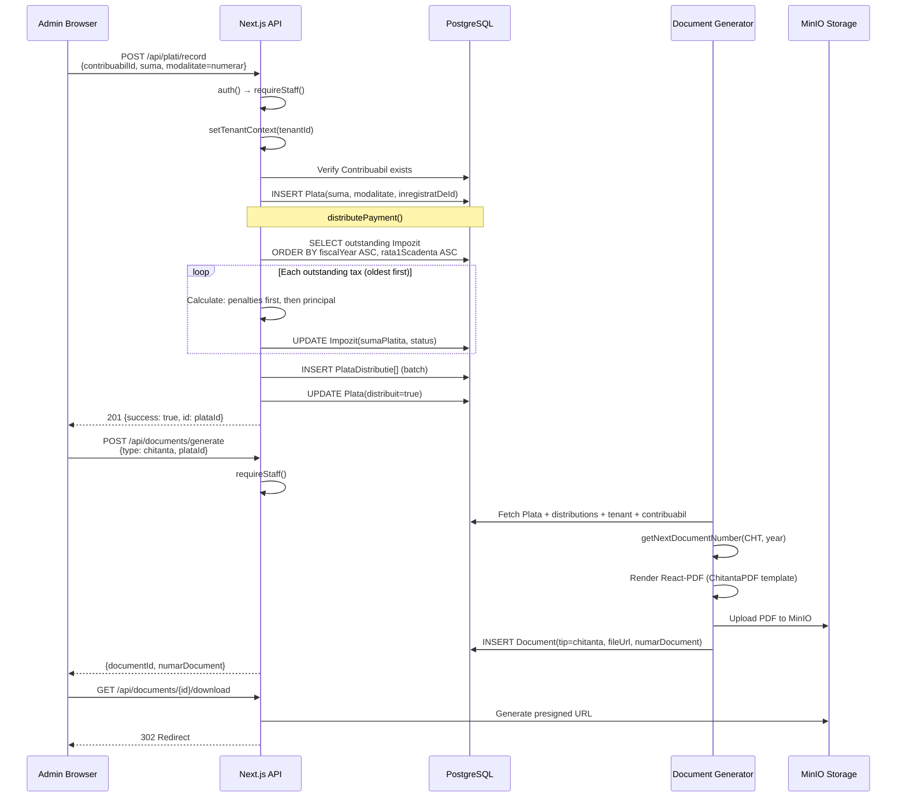
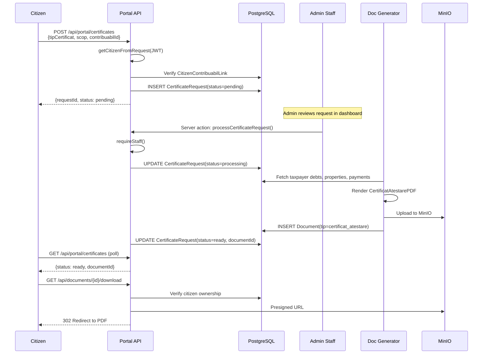
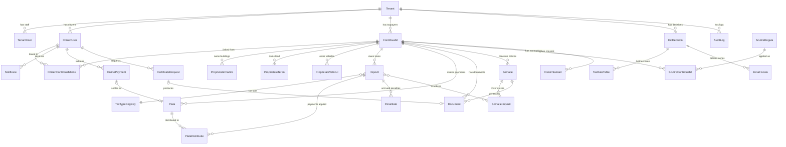

# PrimărIA — Workflow Schemes

> Generated: 2026-02-27

## 1. High-Level Architecture



## 2. Sequence: Citizen Online Payment → Receipt



## 3. Sequence: Admin Cash Payment → Receipt



## 4. Sequence: Certificate Request Flow



## 5. Data Model Overview (Core Entities)



## 6. Tax Calculation Flow

```mermaid
flowchart TD
    START[calculateAllTaxesForContribuabil] --> HCL[resolveActiveHcl<br/>Find active HCL for fiscal year]
    HCL --> EXEMPT[getApplicableExemptions<br/>Find exemption rules]

    HCL --> BLDG[Building Tax Module]
    HCL --> LAND[Land Tax Module]
    HCL --> VEH[Vehicle Tax Module]

    BLDG --> |ProprietateCladire| BLDG_CALC[Calculate per building<br/>• Zone + construction type → rate<br/>• Apply age coefficient<br/>• Prorate by months owned<br/>• Split mixed-use buildings]

    LAND --> |ProprietateTeren| LAND_CALC[Calculate per parcel<br/>• Category + zone → rate per m²<br/>• Intravilan vs extravilan<br/>• Prorate by months]

    VEH --> |ProprietateVehicul| VEH_CALC[Calculate per vehicle<br/>• Euro norm bracket<br/>• Engine power → rate per kW<br/>• Heavy vehicle by axle/mass<br/>• Prorate by months]

    BLDG_CALC --> APPLY_EX[Apply Exemptions<br/>discountPercent from ScutireRegula]
    LAND_CALC --> APPLY_EX
    VEH_CALC --> APPLY_EX

    APPLY_EX --> BONIF[Apply Early Payment Bonus<br/>bonificatie %]

    BONIF --> IMPOZIT[Create/Update Impozit Records<br/>bazaImpozabila, rataAplicata,<br/>sumaCalculata, sumaScutire,<br/>sumaDatorata, rata1, rata2]

    IMPOZIT --> DONE[Return TaxCalculationResult[]]

    style BLDG_CALC fill:#e1f5fe
    style LAND_CALC fill:#e8f5e9
    style VEH_CALC fill:#fff3e0
```

## 7. Authentication Flow

```mermaid
flowchart TD
    subgraph "Staff Login"
        S1[POST /login] --> S2[NextAuth Credentials Provider]
        S2 --> S3{User exists & active?}
        S3 -->|No| S_FAIL[Return null]
        S3 -->|Yes| S4{Tenant active/trial?}
        S4 -->|No| S_FAIL
        S4 -->|Yes| S5{Locked out?<br/>lockedUntil > now}
        S5 -->|Yes| S_FAIL
        S5 -->|No| S6{bcrypt.compare<br/>password valid?}
        S6 -->|No| S7[loginAttempts++<br/>Lock if >= 5]
        S7 --> S_FAIL
        S6 -->|Yes| S8[Reset attempts<br/>Set lastLoginAt]
        S8 --> S9[JWT with role + tenantId<br/>Cookie: next-auth.session-token<br/>maxAge: 8h]
    end

    subgraph "Citizen Login"
        C1[POST /api/portal/auth/login] --> C2[Resolve tenantId]
        C2 --> C3{Citizen exists?<br/>active + verified}
        C3 -->|No| C_FAIL[401 Invalid credentials]
        C3 -->|Yes| C4{Locked out?}
        C4 -->|Yes| C_FAIL
        C4 -->|No| C5{bcrypt.compare}
        C5 -->|No| C6[loginAttempts++<br/>Lock if >= 5]
        C6 --> C_FAIL
        C5 -->|Yes| C7[Reset attempts]
        C7 --> C8[JWT HS256 via jose<br/>Cookie: citizen-token<br/>httpOnly, maxAge: 4h]
    end

    subgraph "Route Protection"
        MW[Middleware] --> MW1{Portal route?}
        MW1 -->|Yes| MW2{citizen-token exists?}
        MW2 -->|No| MW3[Redirect to /portal/login]
        MW2 -->|Yes| MW4[Pass through]
        MW1 -->|No| MW5{Staff route?}
        MW5 -->|Yes| MW6[NextAuth session check]
    end
```


